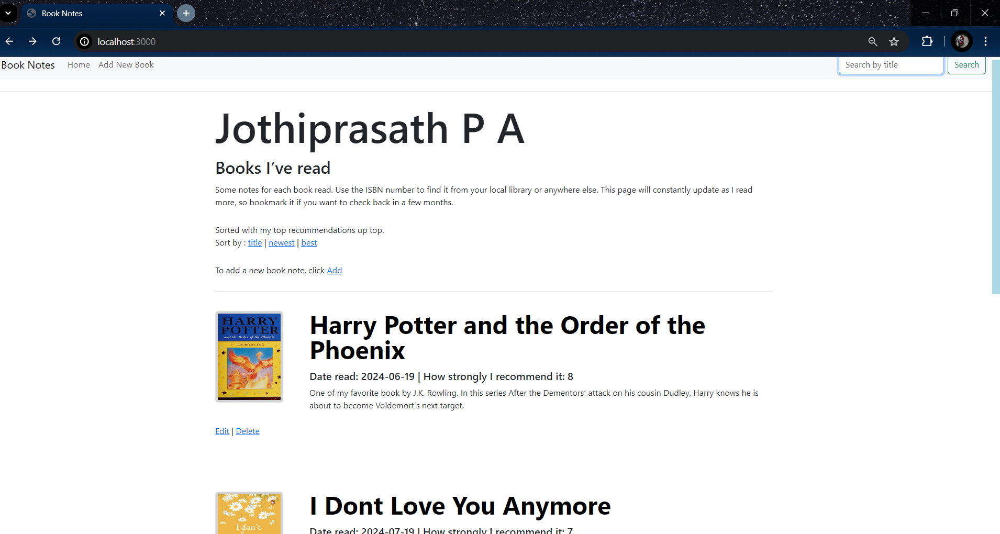
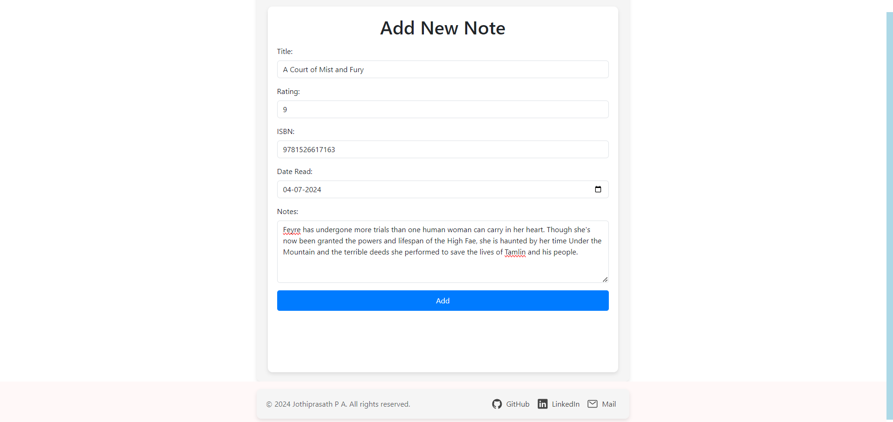
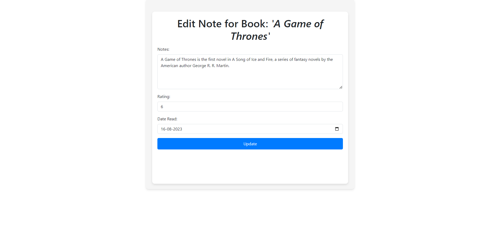
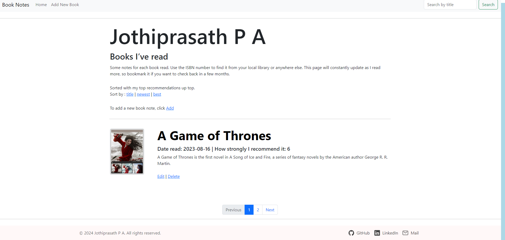

# Book-Note Application

### Project Overview

The ```Book-Note Application``` is a web-based tool designed to manage and document notes for non-fiction books. Built using ```Node.js```, ```Express```, ```EJS```, and ```PostgreSQL```, the application allows users do CRUD method to add, Read, update,and Delete their book notes, including ratings and reading dates. The application also integrates with the ```Open Library API``` to fetch book details.

### To Install Dependencies

```
npm i 

or

npm install
```

## Necessary NPM Packages or Dependencies

* Postgre SQL (Pg) => [pg](https://www.npmjs.com/package/pg)

        - PostgreSQL client for Node.js

* EJS (Embedded Javascript => [ejs](https://www.npmjs.com/package/ejs).

        - Embedded JavaScript templating engine.

* Express => [express](https://www.npmjs.com/package/express).

        - Web framework for Node.js

* Body-parser => [body-parser](https://www.npmjs.com/package/body-parser)

      - Middleware to parse incoming request bodies.
      
* Axios => [axios](https://www.npmjs.com/package/axios)

      -Axios is a promise-based HTTP client for Node.js and the browser to make HTTP requests.
      
* Method-Override => [method-override](https://www.npmjs.com/package/method-override)

        -Method-Override is a middleware for Node.js that allows you to use HTTP verbs.
        
## Features

* **Add New Books:** Users can add new books to their collection, including titles, authors, and read_date and their ratings.

* **Update Book Notes:** Users can update their notes, ratings, and reading dates for each book.

* **View Book Details:** Users can view detailed information about their book Notes.

* **Search for Books:** Users can search for books which they stored.

* **Sort Books:** Users can sort books by rating, recency, or title

### Technologies Used

* **Frontend:** EJS, CSS, Bootstrap
* **Backend:** Node.js, Express.js
* **Database:** PostgreSQL
* **NPM Libraries:** body-parser, express, pg, ejs, axios, method-override
* **API:** Open Library API => [API](https://covers.openlibrary.org/b/isbn)

### Prerequisites

* Node.js (v12.x or higher)
* npm (Node Package Manager)
* Postgre SQL(pgadmin)
* API

### Set up the PostgreSQL database

- Ensure PostgreSQL is installed and running.
- Create a database for the project.
- Set up the database schema

### To start the server 

```
nodemon server.js 

or

node server.js
```

##### Open in Browser

Open your browser and navigate to ```http://localhost:3000``` to view the application.

## Screenshots









## License 

This project is licensed under the MIT License - see the [MIT](https://choosealicense.com/licenses/mit/) License file for details.
